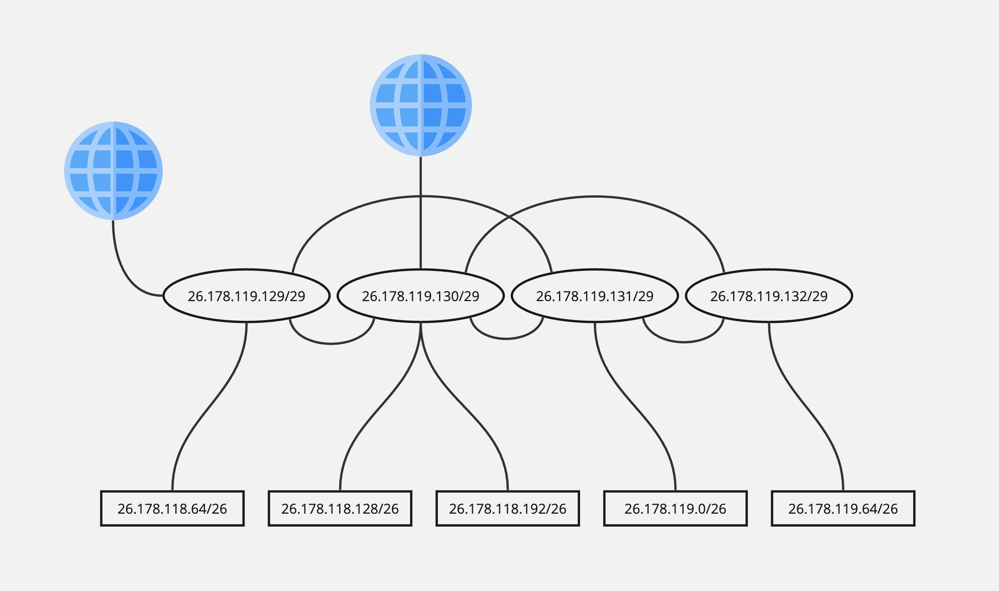

# Отчет по практическому занятию No3
## IP адресация и маршрутизация

---
## Список исполнителей

**Московский Авиационный Институт (МАИ)**  
*Институт 3 «Системы управления, информатика и электроэнергетика»*  
Кафедра 307 «Цифровые технологии и информационные системы»

**Работу выполнил студент группы М3О-214Б-22 — Бедретдинов Андрей Маратович**

---

## Содержание

1. [Список исполнителей](#Список-исполнителей)
2. [Введение](#Введение)
3. [Сетевая схема](#Сетевая-схема)
4. [Маршрутизация](#Маршрутизация)
5. [Вывод](#Вывод)

---

## Введение

В данном задании необходимо настроить маршрутизацию для связи пяти филиалов, используя четыре маршрутизатора. Каждый филиал имеет сеть из 30-40 рабочих станций с маской подсети `255.255.255.192`.

---

## Сетевая схема

IP-адреса сетей филиалов были получены путем наложения маски на IP `26.178.118.86`:

- Первый филиал: 26.178.118.64/26
- Второй филиал: 26.178.118.128/26
- Третий филиал: 26.178.118.192/26
- Четвертый филиал: 26.178.119.0/26
- Пятый филиал: 26.178.119.64/26

Полученные IP-адреса для маршрутизаторов:

- Роутер 1: 26.178.119.129/29
- Роутер 2: 26.178.119.130/29
- Роутер 3: 26.178.119.131/29
- Роутер 4: 26.178.119.132/29

---

## Маршрутизация
### Маршрутизатор 1 (26.178.119.129/29)

| Сеть             | Шлюз             | Приоритет |
|------------------|------------------|-----------|
| 26.178.118.64/26 | 26.178.119.129/29 | 10        |
| 26.178.118.128/26 | 26.178.119.130/29 | 1         |
| 26.178.118.128/26 | 26.178.119.131/29 | 10        |
| 26.178.118.192/26 | 26.178.119.130/29 | 1         |
| 26.178.118.192/26 | 26.178.119.131/29 | 10        |
| 26.178.119.0/26   | 26.178.119.130/29 | 10        |
| 26.178.119.0/26   | 26.178.119.131/29 | 1         |
| 26.178.119.64/26  | 26.178.119.130/29 | 1         |
| 26.178.119.64/26  | 26.178.119.131/29 | 10        |
| 0.0.0.0/0         | 26.178.119.129/29 | 1         |
| 0.0.0.0/0         | 26.178.119.130/29 | 5         |
| 0.0.0.0/0         | 26.178.119.131/29 | 10        |

### Маршрутизатор 2 (26.178.119.130/29)

| Сеть             | Шлюз             | Приоритет |
|------------------|------------------|-----------|
| 26.178.118.64/26 | 26.178.119.129/29 | 1         |
| 26.178.118.64/26 | 26.178.119.131/29 | 5         |
| 26.178.118.64/26 | 26.178.119.132/29 | 10        |
| 26.178.118.128/26 | 26.178.119.130/29 | 10        |
| 26.178.118.192/26 | 26.178.119.130/29 | 10        |
| 26.178.119.0/26   | 26.178.119.129/29 | 5         |
| 26.178.119.0/26   | 26.178.119.131/29 | 1         |
| 26.178.119.0/26   | 26.178.119.132/29 | 10        |
| 26.178.119.64/26  | 26.178.119.129/29 | 10        |
| 26.178.119.64/26  | 26.178.119.131/29 | 5         |
| 26.178.119.64/26  | 26.178.119.132/29 | 1         |
| 0.0.0.0/0         | 26.178.119.129/29 | 4         |
| 0.0.0.0/0         | 26.178.119.130/29 | 1         |
| 0.0.0.0/0         | 26.178.119.131/29 | 7         |
| 0.0.0.0/0         | 26.178.119.132/29 | 10        |

### Маршрутизатор 3 (26.178.119.131/29)

| Сеть             | Шлюз             | Приоритет |
|------------------|------------------|----------|
| 26.178.118.64/26 | 26.178.119.129/29 | 1        |
| 26.178.118.64/26 | 26.178.119.130/29 | 5        |
| 26.178.118.64/26 | 26.178.119.132/29 | 10       |
| 26.178.118.128/26 | 26.178.119.129/29 | 5        |
| 26.178.118.128/26 | 26.178.119.130/29 | 1        |
| 26.178.118.128/26 | 26.178.119.132/29 | 10       |
| 26.178.118.192/26 | 26.178.119.129/29 | 5        |
| 26.178.118.192/26 | 26.178.119.130/29 | 1        |
| 26.178.118.192/26 | 26.178.119.132/29 | 10       |
| 26.178.119.0/26   | 26.178.119.131/29 | 10        |
| 26.178.119.64/26  | 26.178.119.129/29 | 10        |
| 26.178.119.64/26  | 26.178.119.130/29 | 5         |
| 26.178.119.64/26  | 26.178.119.132/29 | 1         |
| 0.0.0.0/0         | 26.178.119.129/29 | 5         |
| 0.0.0.0/0         | 26.178.119.130/29 | 1         |
| 0.0.0.0/0         | 26.178.119.132/29 | 10        |

### Маршрутизатор 4 (26.178.119.132/29)

| Сеть             | Шлюз             | Приоритет |
|------------------|------------------|-----------|
| 26.178.118.64/26 | 26.178.119.130/29 | 10        |
| 26.178.118.64/26 | 26.178.119.131/29 | 1         |
| 26.178.118.128/26 | 26.178.119.130/29 | 1         |
| 26.178.118.128/26 | 26.178.119.131/29 | 10        |
| 26.178.118.192/26 | 26.178.119.130/29 | 1         |
| 26.178.118.192/26 | 26.178.119.131/29 | 10        |
| 26.178.119.0/26   | 26.178.119.130/29 | 10        |
| 26.178.119.0/26   | 26.178.119.131/29 | 1         |
| 26.178.119.64/26  | 26.178.119.132/29 | 10        |
| 0.0.0.0/0         | 26.178.119.130/29 | 1         |
| 0.0.0.0/0         | 26.178.119.131/29 | 10        |

---

## Вывод
Настроена маршрутизация для связи пяти филиалов с использованием четырех маршрутизаторов. Каждая сеть имеет основные и резервные маршруты через определенные маршрутизаторы, что обеспечит эффективную связь между филиалами.
